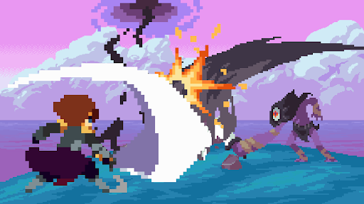
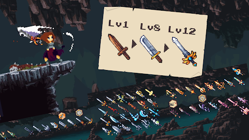
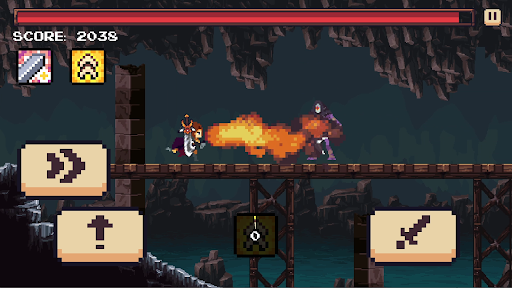
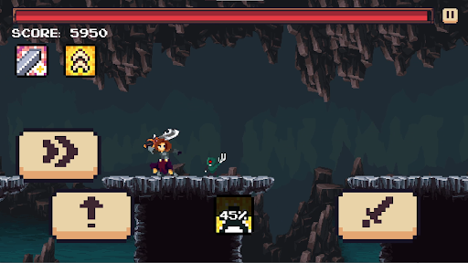
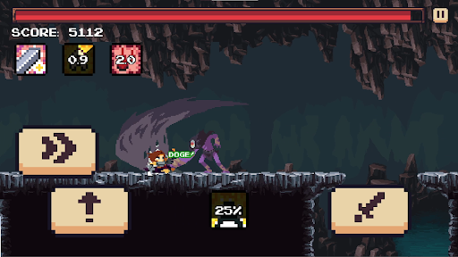
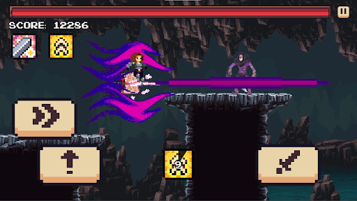
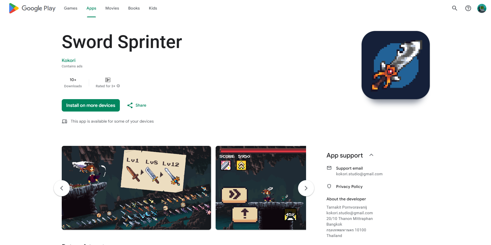

# Sword Sprinter

&nbsp;&nbsp;&nbsp;&nbsp;Sword Sprinter is an action-packed mobile game developed with the Godot Engine. Players embark on an exciting journey through dark dungeons, battling fierce enemies with powerful swords and upgrading skills to reach new levels of strength. This game combines fast-paced gameplay with engaging upgrades, challenging players to survive and thrive in an epic adventure.

## Features
- **Intense Battles**: Engage in epic sword fights against various enemies and bosses.
- **Sword Upgrades**: Earn points to upgrade your swords, each type offering unique skills and abilities that enhance your power as you progress.
- **Dungeon Exploration**: Run, jump, and fight your way through mysterious and challenging dungeons.
- **Responsive Controls**: Simple and intuitive controls designed for an optimal mobile experience.

## Gameplay
&nbsp;&nbsp;&nbsp;&nbsp;In Sword Sprinter, players take on the role of a courageous warrior venturing into dark dungeons. With each level, new enemies and challenges await. Slash through foes, avoid traps, and collect items to boost your abilities. The further you progress, the stronger your enemies become—requiring strategic skill upgrades and weapon enhancements.

<video width="600" controls>
  <source src="./resources/Gameplay.mp4" type="video/mp4">
  Your browser does not support the video tag.
</video>

## Development Process
Sword Sprinter was developed using:
- **Game Engine**: Godot
- **Programming Language**: GDScript
- **Art and Audio**: Custom pixel art and carefully chosen sound effects to enhance immersion.

## Technologies Used
- **Godot Engine**: For game development and deployment.
- **GDScript**: To create dynamic gameplay and handle game logic.
- **Pixel Art Tools**: For creating visually appealing sprites and backgrounds.
- **Audio Integration**: Immersive sound effects that enhance gameplay experience.

## Screenshots
Here are a few glimpses of the game:

## Installation
To play Sword Sprinter, download the game from:
- Google Play Store

- Itch.io (Coming Soon!)

---

Embark on a dungeon-crawling adventure, master your sword skills, and conquer every challenge that stands in your way with **Sword Sprinter**!
